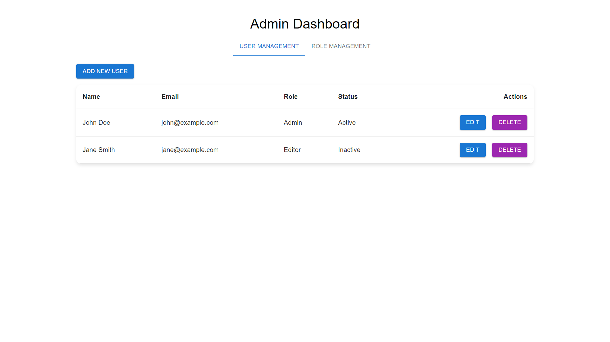
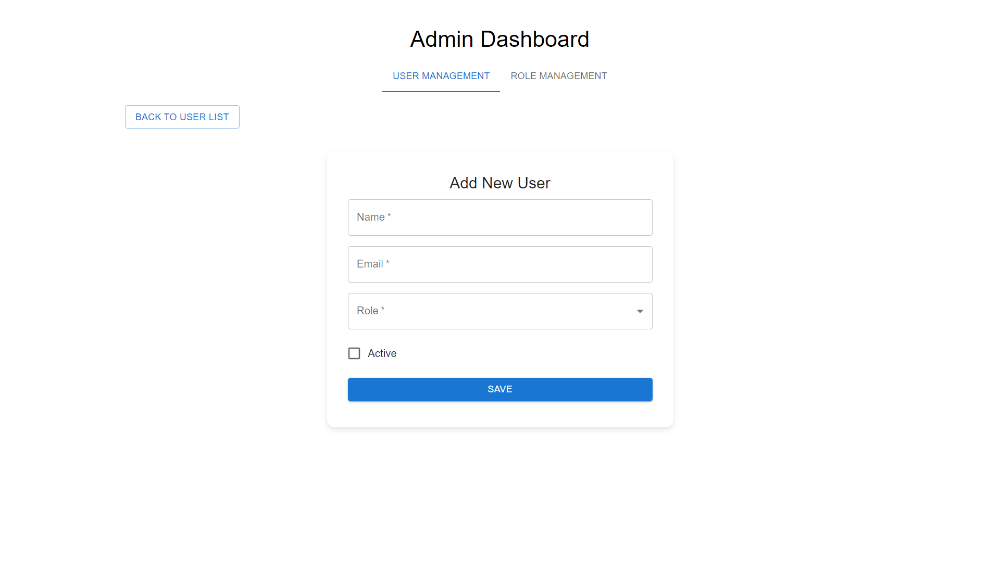
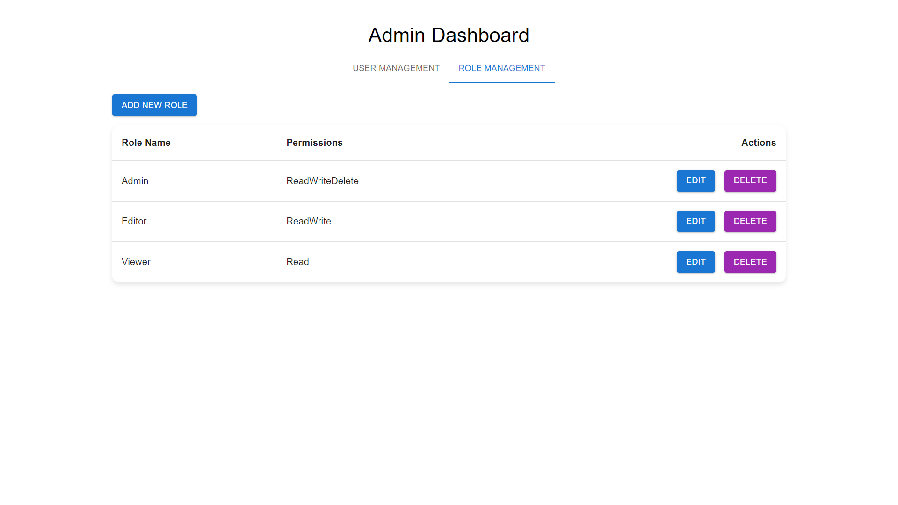

# Admin Dashboard

Admin Dashboard is a **React.js** application designed to manage users, roles, and permissions efficiently. This application is built with **Material-UI** for a modern and responsive design and implements a comprehensive Role-Based Access Control (RBAC) system.

---

## Key Features

### User Management
- **View Users**: Display all users in a table view with detailed information.
- **Add/Edit/Delete Users**: Easily manage user details with action buttons.
- **Assign Roles**: Dynamically assign roles to users.
- **Manage Status**: Toggle user status between Active and Inactive.

### Role Management
- **Create Roles**: Add new roles with desired attributes.
- **Edit Roles**: Modify role details dynamically.
- **Role Permissions**: Assign permissions such as Read, Write, or Delete to roles.

### Permission Management
- **Dynamic Permissions**: Assign and update permissions for roles with an intuitive UI.
- **Clear Layout**: Clearly display permissions for easy understanding.

---

## Technologies Used

- **Frontend Framework**: React.js
- **UI Library**: Material-UI
- **Mock API**: Simulated backend responses for CRUD operations

---

## Prerequisites

Make sure the following are installed:
- [Node.js](https://nodejs.org/) (v14 or higher)
- npm (comes with Node.js) or yarn

---

## Installation and Setup

```bash
git clone https://github.com/Pareekutsav/RBAC.git
cd RBAC
npm install
npm start
```
Open your browser and navigate to:
```http://localhost:3000```

## Directory Structure

```
RBAC/
├── public/                            # Static files
│   ├── screenshots/
│   │   ├── dashboard-view.png
│   │   ├── user-management.png
│   │   └── role-management.png 
│   └── mock/
│       └── db.json                    # User and Roles JSON
├── src/
│   ├── components/                    # Reusable UI components (Tables, Modals, etc.)
│   │    ├── RoleManagement/           # Role and Permission management
|   │    │   ├── RoleForm.js
│   │    │   ├── RoleManagememt.js
│   │    │   └── RoleTable.js
│   │    ├── TableWithActions/         # Reusable Table UI component
│   │    │   └── index.js
│   │    └── UserManagement/           # User and Status management
|   │        ├── UserForm.js 
│   │        ├── UserManagememt.js
│   │        └── UserTable.js
│   ├── App.js                         # Main application component
│   ├── index.js                       # Application entry point
│   └── index.css                      # Global and custom styles
├── package-lock.json                  # Locked dependencies and scripts
├── package.json                       # Dependencies and scripts
└── README.md                          # Project documentation
```

## Screenshots

### User Table


### Add User


### Role Management


### Add Role
